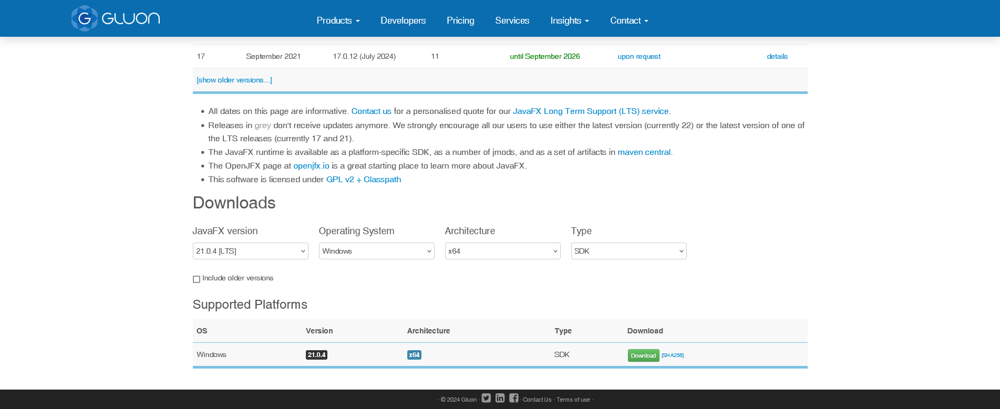
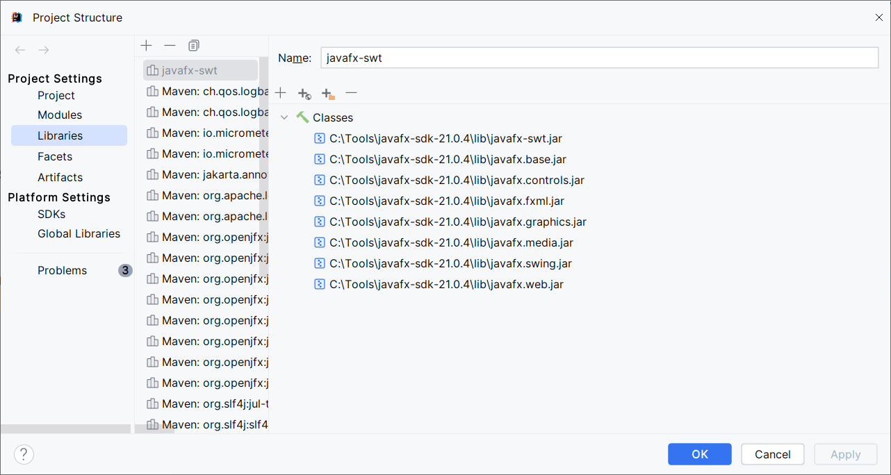

# Spring JavaFX Boot

A JavaFX + Spring Boot starter project. It requires JavaFX SDK on your system.

Download JavaFX SDK from Gluon website:

Add the JavaFX SDK library files to your IntelliJ IDE:

For further information read the following article:
https://medium.com/@chanakaanuruddha/integrating-javafx-with-spring-boot-a-comprehensive-guide-709542439fff

Also, might be interesting to look at (for further improvement):
https://stackoverflow.com/questions/62728316/my-springboot-powered-javafx-application-wont-run-no-qualifying-bean-of-type

The project was remade to use this library primarily dedicated for this issue:
https://github.com/rgielen/javafx-weaver